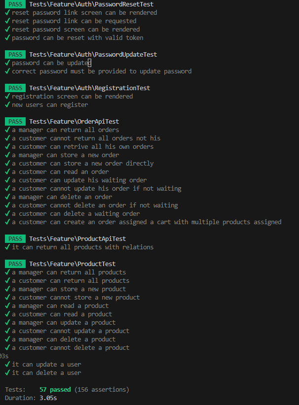

# maltina_test

I haven't finished the task yet, but i am commiting more, thanks for your time.

1. I will add some blade page for admin panel and change the test acordingly
--------------------------------------------------------------------------------

Rock star shop Challenge
A RESTful Laravel development challenge for managing a small coffee shop

Introduction
In this challenge, I am going to develop a small Laravel web application which manages Rock star coffee shop orders via REST APIs.

- In Rock star, the manager can define variety of products via admin panel. 
- Customers are able to order and customize their coffee with several options. 
- Orders can have a status: waiting, preparation, ready, delivered. 
- Manager can change orders status.
- After each status change on order, I would notify the customer via email.

A sample catalog of products offered by Rock star could be like this:
   - Production > Customization option
     - Latte > Milk: skim, semi, whole
     - Cappuccino > Size: small, medium, large
     - Hot chocolate > Size: small, medium, large
     - Espresso > Shots: single, double, triple
     - Cookie > Kind: chocolate chip, ginger
     - Tea
     - All > Consume location: take away, in shop

The following REST APIs should be implemented and any customer should be able to consume the API using a secure way:
    - View Menu (list of products)        
    - Order at coffee shop with options
    - View his order (product list, pricing & order status)
    - Change a waiting order
    - Cancel waiting orders => as there are no "cancel" in status condition, i asume it meant a soft-delete by the customer

* As mentioned in the Challenge description, For the sake of simplicity, I'll consider each product has a constant price no matter which option is selected.
* API response format is up to me.
-------------------------------------------------------------------------------------------------------------------------------------------------------------

I will go with TDD aproche and in the first step i would create the ProductControllerTest. Then Product models, a few Factory/seeder classes. Then define the controller itself.

In this challenge i would simply use "role" field to define the role. There are variuos ways to manage this better, (ex: roles, using role_user and permission_role,.. tables or using spatie/laravel-permission package).
I use seperate event, listener and notification classes so it could be more decoupled, maybe we need to add an sms notification later or save the event in the DB or ..

## Product model
As my understanding of the product description, the products can have just one type at a time (Cookie has "Kind" type and does not have "Shots" type).
I used string type for "type" and "customizations" field as it could added/change over time.
Price is unsignedInteger as a non-decimal price we use in rials. It could be an unsignedBigInteger too.
I want the ability to extend the behavior of products (types and customizations) without modifying the existing Product class (OCP principle). 
First defining ProductModelTest.

## Order model
I use Enum for "consume_location" and "status" fields as i assume they won't change frequently.
Orders are softdeleted so the record of orders are maintaned, specially if a customer wants to cancel an order (as we don't have a delete or cancel status for it).

## Cart model
Lets create a cart so we can keep track of products and selected options that users add to thier orders, So I create a cart model and a cart_product table. Keep in mind that we could have created an order_product table and skip the cart model. In this example the cart model could be kind of over design but I go with it.

## Refactor and adding a few service class
I tried to Refactor the controllers, as they don't have too much bussiness logic, these classes are small.

## RESULTS
| # 	| Description                                      	| Status 	|
|---	|--------------------------------------------------	|--------	|
| 1 	| TDD                                              	| Done ✅|
| 2 	| Api: Manager can define products                  | Done ✅|
| 3 	| Api: Manager can change orders status             | Done ✅|
| 2 	| Admin Panel: Manager can define products          | ongoing 🔲|
| 3 	| Admin Panel: Manager can change orders status     | ongoing 🔲|
| 4 	| REST API: View Menu (list of products)            | Done ✅|
| 5 	| REST API: Order at coffee shop with options       | Done ✅|
| 6 	| REST API: View his/her order (product list, pricing & order status) | Done ✅|
| 7 	| REST API: Change a waiting order                  | Done ✅|
| 8 	| REST API: Cancel a waiting order                  | Done ✅|
| 9 	| After each status change on order: notify the customer via email.          | Done ✅|
| 10 	| clone the repository (public mode)               	| Done ✅|
| 11 	| Clean git commits that shows my work progress. 	  | Done ✅|
| 12 	| meaningful comments and docstrings                | Done ✅|
| 13 	| Refactoring and Add services                      | Done ✅|
|---	|--------------------------------------------------	|--------	|

## TEST RESULTS
Throughout the project, various aspects have been thoroughly tested. Here are the test results:

## HOW TO USE THE CODE BASE
To get started with the code base, follow these instructions:

##UP AND RUNNING
Fill out the .env with a brand new DB and you are good to go.
You can run the project by using the following commands:

    # for the first time use 
     composer update
     php artisan db:seed --class=UserManagerSeeder
     php artisan serve

     http://127.0.0.1:8000/admin/login //FilamentPhp admin panel is accessable from

    username:mohiti.ehsan@gmail.com
    password:120120120
    

**** This panel is just for the show case of the table rows and you may create products with it. I would complete the task and add the simple blade panel for the admin to create products and edit them.
